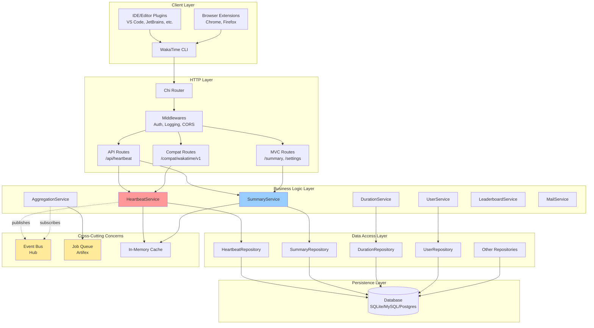
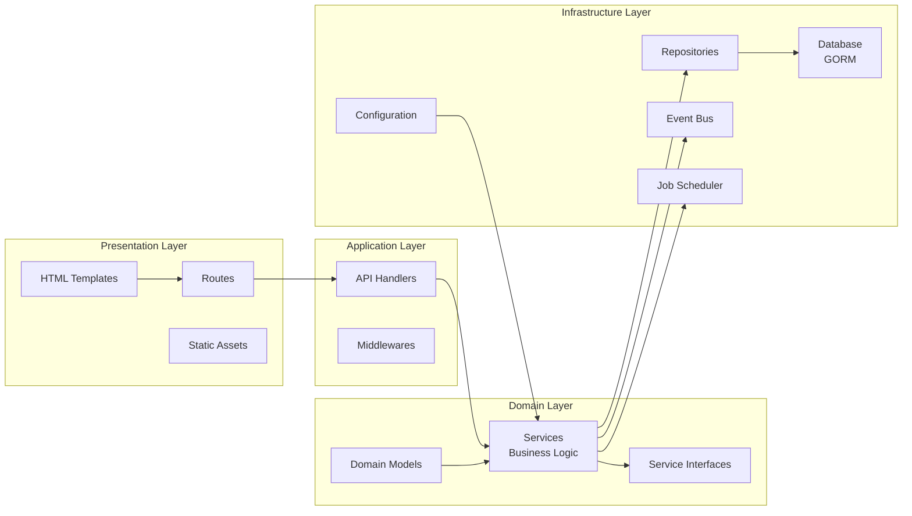
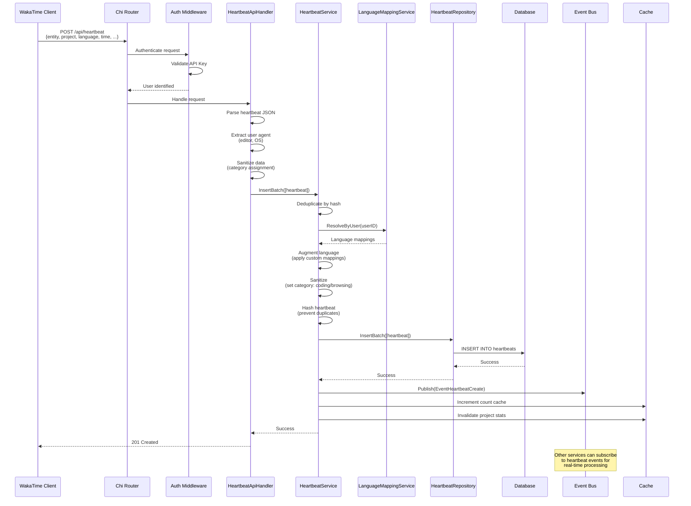
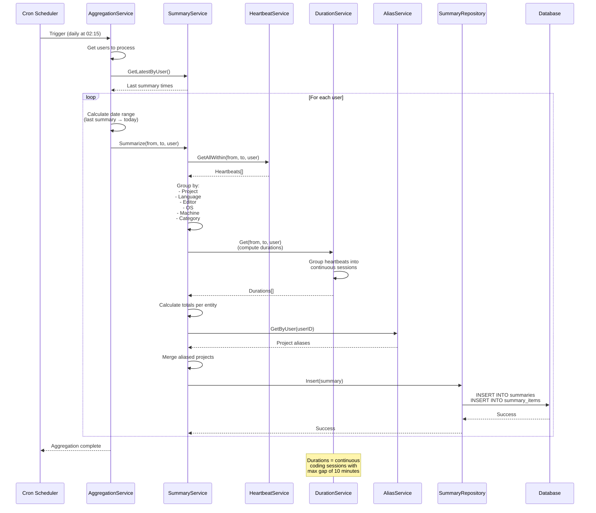
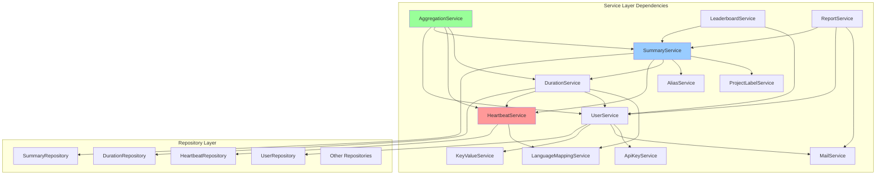
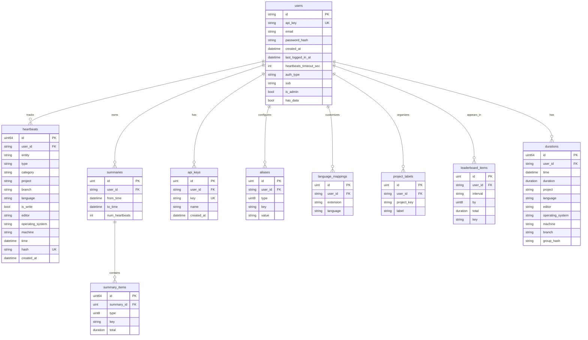
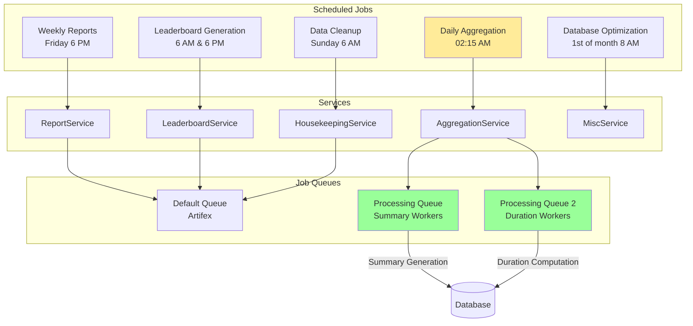
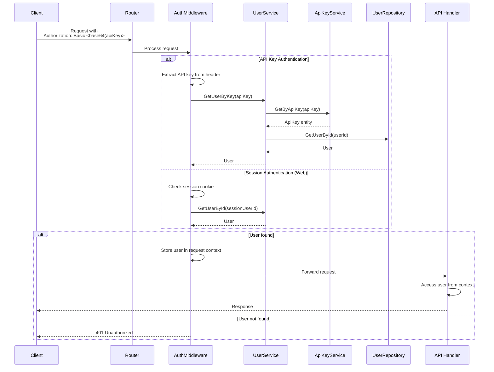
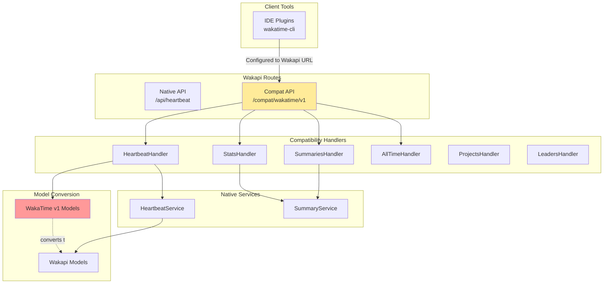
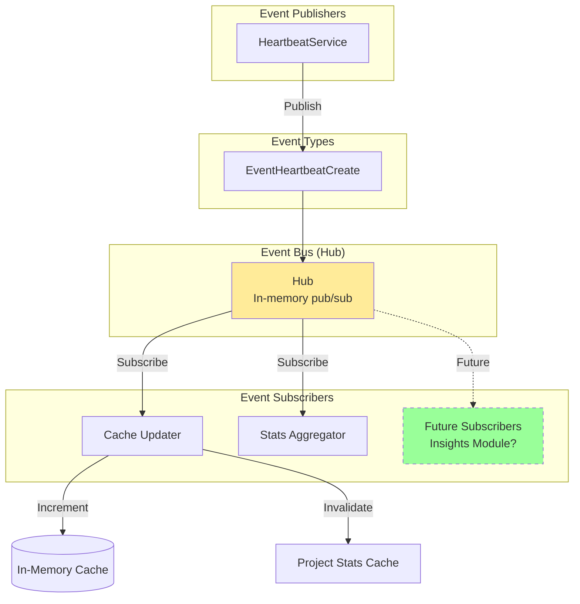

# Wakapi Architecture Documentation

**Generated:** 2025-12-02
**Purpose:** Understanding system and data flow for OxyWaka fork evaluation

---

## Table of Contents
1. [System Architecture Overview](#1-system-architecture-overview)
2. [Layered Architecture](#2-layered-architecture)
3. [Heartbeat Data Flow](#3-heartbeat-data-flow-critical-path)
4. [Summary Generation Flow](#4-summary-generation-flow)
5. [Service Dependency Graph](#5-service-dependency-graph)
6. [Database Schema](#6-database-schema)
7. [Background Jobs & Scheduling](#7-background-jobs--scheduling)
8. [Authentication Flow](#8-authentication-flow)
9. [WakaTime Compatibility Layer](#9-wakatime-compatibility-layer)
10. [Event-Driven Architecture](#10-event-driven-architecture)

---

## 1. System Architecture Overview



---

## 2. Layered Architecture



**Key Principles:**
- **Dependency Direction**: Always flows inward (outer layers depend on inner layers)
- **Interface-Based**: All services expose interfaces for testability
- **Repository Pattern**: Data access abstracted through repositories
- **Event-Driven**: Services communicate via event bus for loose coupling

---

## 3. Heartbeat Data Flow (Critical Path)

This is the **most important flow** for OxyWaka - tracking every keystroke and activity.



**Key Observations for OxyWaka:**
1. **Category field** is assigned during sanitization (coding vs browsing)
2. **Event bus** publishes heartbeat events - perfect hook for insights module
3. **Hash-based deduplication** prevents duplicate entries
4. **Language mapping** allows custom categorization

---

## 4. Summary Generation Flow

Summaries are pre-computed aggregations for fast dashboard rendering.



**Summary Structure:**
- **Summary**: Time range container (from, to, user)
- **SummaryItems**: Individual aggregations (project: "wakapi" → 3600 seconds)
- **Types**: Project, Language, Editor, OS, Machine, Category, Branch, Entity

---

## 5. Service Dependency Graph



**Service Initialization Order** (from main.go:179-199):
1. Foundation: MailService, KeyValueService
2. User layer: ApiKeyService, UserService
3. Mapping: LanguageMappingService, ProjectLabelService
4. Core tracking: HeartbeatService
5. Analytics: DurationService, SummaryService
6. Aggregation: AggregationService
7. Features: ReportService, LeaderboardService, ActivityService

---

## 6. Database Schema



**Key Tables for OxyWaka:**

1. **heartbeats**: Raw activity data
   - `category`: "coding" vs "browsing" (critical for insights)
   - `is_write`: Active coding indicator
   - `time`: Millisecond precision timestamps
   - Indexed: user_id + time, project, language

2. **durations**: Continuous coding sessions
   - Pre-computed from heartbeats
   - Groups by 10-minute max gap
   - Perfect for "deep work" detection

3. **summaries + summary_items**: Pre-aggregated stats
   - Fast dashboard queries
   - Multiple dimensions (project, language, editor, OS, category)

**Extension Point for Insights:**
Add new tables:
- `insight_scores`: Daily productivity scores
- `activity_patterns`: Deep work sessions, context switches
- `recommendations`: AI-generated suggestions

---

## 7. Background Jobs & Scheduling



**Background Processing:**
- **Artifex Dispatcher**: Job queue with worker pools
- **Cron Syntax**: Extended cron format (second minute hour day month weekday)
- **Parallel Processing**: Multiple workers for summary/duration generation

**Jobs:**
1. **Aggregation** (02:15): Generate daily summaries for all users
2. **Reports** (Fri 18:00): Email weekly reports to opted-in users
3. **Leaderboard** (06:00 & 18:00): Recompute public rankings
4. **Cleanup** (Sun 06:00): Delete old data based on retention policy
5. **Optimize** (1st @ 08:00): VACUUM (SQLite/Postgres) or OPTIMIZE (MySQL)

---

## 8. Authentication Flow



**Authentication Methods:**
1. **API Key** (WakaTime clients): `Authorization: Basic <base64(apiKey)>`
2. **Session Cookie** (Web UI): Gorilla sessions
3. **OpenID Connect** (Optional SSO): OAuth2 with OIDC

**Security Features:**
- Password hashing: Argon2id
- API key storage: Database with unique constraint
- Rate limiting: Chi middleware (per IP)
- CORS: Configurable origins

---

## 9. WakaTime Compatibility Layer



**Compatibility Endpoints:**
- `/compat/wakatime/v1/users/current/heartbeats` → HeartbeatHandler
- `/compat/wakatime/v1/users/current/summaries` → SummariesHandler
- `/compat/wakatime/v1/users/current/stats` → StatsHandler
- `/compat/wakatime/v1/users/current/all_time_since_today` → AllTimeHandler

**Model Conversion:**
- WakaTime JSON format → Wakapi models
- Located in: `models/compat/wakatime/v1/`
- Ensures plugins work without modification

---

## 10. Event-Driven Architecture



**Event System:**
- **Hub**: Lightweight pub/sub (github.com/leandro-lugaresi/hub)
- **Events**: `EventHeartbeatCreate` published on every heartbeat
- **Subscribers**: Listen for events and react asynchronously

**Current Uses:**
1. **Cache management**: Increment user heartbeat counts
2. **Stats invalidation**: Clear cached project statistics

**OxyWaka Opportunity:**
```go
// Future: insights module subscribes to heartbeat events
sub := eventBus.Subscribe(0, config.EventHeartbeatCreate)
go func() {
    for msg := range sub.Receiver {
        heartbeat := msg.Fields[config.FieldPayload].(*models.Heartbeat)
        // Real-time insights computation
        insightsService.ProcessHeartbeat(heartbeat)
    }
}()
```

---

## Key Architectural Patterns

### 1. **Repository Pattern**
- Abstracts database operations
- All queries go through repositories
- Enables easy database switching

### 2. **Service Layer Pattern**
- Business logic isolated in services
- Interface-based for testability
- Constructor injection of dependencies

### 3. **Dependency Injection**
- Manual DI (no framework)
- All dependencies injected via constructors
- Main.go orchestrates initialization

### 4. **Event-Driven Communication**
- Loose coupling between components
- Pub/sub pattern via Hub
- Async processing

### 5. **Interface Segregation**
- Each service defines its interface
- Mock implementations for testing
- Clear contracts between layers

---

## Extension Points for OxyWaka

### 1. **Add Insights Service**
```go
// services/insights.go
type InsightsService struct {
    heartbeatSvc IHeartbeatService
    summarySvc   ISummaryService
    durationSvc  IDurationService
}

func (s *InsightsService) ComputeDailyScore(user *User, date time.Time) float64 {
    // Analyze heartbeats for the day
    // Detect deep work sessions
    // Quantify context switches
    // Return productivity score
}
```

### 2. **Subscribe to Heartbeat Events**
```go
// Real-time insights on every heartbeat
sub := eventBus.Subscribe(0, config.EventHeartbeatCreate)
go func() {
    for msg := range sub.Receiver {
        hb := msg.Fields[config.FieldPayload].(*models.Heartbeat)
        insightsService.ProcessRealtimeHeartbeat(hb)
    }
}()
```

### 3. **Add Insights API Routes**
```go
// routes/api/insights.go
func (h *InsightsHandler) GetDailyScore(w http.ResponseWriter, r *http.Request) {
    user := middlewares.GetPrincipal(r)
    score := h.insightsSvc.GetDailyScore(user, time.Now())
    helpers.RespondJSON(w, r, http.StatusOK, score)
}
```

### 4. **Extend Database Schema**
```sql
CREATE TABLE insight_scores (
    id INTEGER PRIMARY KEY,
    user_id TEXT NOT NULL,
    date DATE NOT NULL,
    productivity_score REAL,
    deep_work_minutes INTEGER,
    context_switches INTEGER,
    FOREIGN KEY (user_id) REFERENCES users(id)
);
```

---

## Performance Considerations

### 1. **Caching Strategy**
- In-memory cache (patrickmn/go-cache)
- User heartbeat counts cached (24h TTL)
- Project stats cached, invalidated on new heartbeats
- Summary totals cached per user

### 2. **Database Optimizations**
- Indexed queries (user_id + time)
- Batch inserts for heartbeats
- Pre-computed summaries (avoid real-time aggregation)
- Streaming queries for large datasets

### 3. **Background Processing**
- Job queues prevent API blocking
- Worker pools for parallel processing
- Scheduled batch jobs (not real-time)

### 4. **Query Patterns**
- Use durations table for session queries (not raw heartbeats)
- Use summaries table for dashboard stats (not real-time aggregation)
- Stream heartbeats for large date ranges (not in-memory)

---

## Critical Files for Understanding

| File | Purpose | Lines | Key Concepts |
|------|---------|-------|--------------|
| `main.go` | Initialization & DI | 500 | Service wiring, startup |
| `models/heartbeat.go` | Core data model | 177 | Heartbeat structure |
| `services/heartbeat.go` | Heartbeat logic | 400+ | Insert, dedupe, events |
| `services/summary.go` | Aggregation logic | 400+ | Summary generation |
| `services/aggregation.go` | Batch processing | 300+ | Daily jobs |
| `repositories/heartbeat.go` | Data access | 400+ | GORM queries |
| `routes/api/heartbeat.go` | API endpoint | 200+ | HTTP handling |
| `config/config.go` | Configuration | 500+ | Settings management |
| `migrations/migrations.go` | Schema management | 137 | Database evolution |

---

## Questions for OxyWaka?

1. **Real-time vs Batch Insights**: Subscribe to events for real-time, or compute during aggregation?
2. **Storage Strategy**: New tables for insights, or extend existing summaries?
3. **AI Integration**: Embedded Go ML, or external Python service?
4. **UI Extension**: Extend existing dashboard views, or new insights page?

---

**Generated with Claude Code for OxyWaka fork evaluation**
